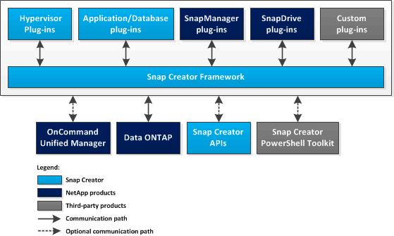

= Snap Creator 프레임워크의 기능
:icons: font
:imagesdir: ../media/

[role="lead"]
Snap Creator 프레임워크는 사전 패키지형 및 맞춤형 플러그인을 사용하여 Windows 및 UNIX(AIX, HP-UX, Linux 및 Solaris) 환경에서 다양한 타사 애플리케이션, 데이터베이스 및 하이퍼바이저의 데이터 보호를 표준화하고 간소화할 수 있습니다.

Snap Creator는 Snapshot, SnapVault, 오픈 시스템 SnapVault 및 SnapMirror 기능과 NetApp 관리 콘솔 데이터 보호 기능, 운영 관리자 콘솔 및 FlexClone을 활용하여 다음과 같은 이점을 제공합니다.

* 애플리케이션 정합성이 보장되는 데이터 보호
+
중요한 정보를 백업하고 기존 애플리케이션 아키텍처와 통합하여 데이터 일관성을 보장하고 운영 비용을 절감하는 중앙 집중식 솔루션입니다.

* 확장성
+
모듈식 아키텍처와 정책 기반 자동화를 통해 빠른 통합 달성

* 클라우드 지원
+
물리적 플랫폼과 가상 플랫폼을 지원하고 서비스형 IT 및 클라우드 환경과 상호 작용하는 운영 체제와 독립적인 Snap Creator 기능

* 클로닝 기능
+
개발 및 테스트 용도로 공간 효율적인 데이터 클로닝이 지원됩니다.

다음 그림에서는 Snap Creator 프레임워크의 구성 요소를 보여 줍니다.

