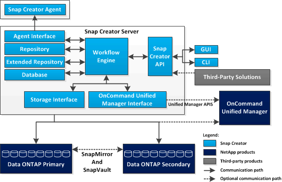

= Snap Creator 서버 개요
:icons: font
:imagesdir: ../media/

[role="lead"]
Snap Creator Server는 Snap Creator 프레임워크의 주요 엔진입니다.

일반적으로 Snap Creator Server는 물리적 호스트 또는 가상 호스트에 설치됩니다. 이 서버는 Snap Creator 그래픽 사용자 인터페이스(GUI)와 작업, 일정, 사용자, 역할, 프로필 및 스토리지 유형에 대한 정보를 저장하는 데 필요한 플러그인 메타데이터뿐만 아니라 구성 파일도 제공합니다. Snap Creator Server가 때때로 Snap Creator 내에서 SCServer로 축소됩니다.

다음 그림에서는 Snap Creator Server의 아키텍처를 보여 줍니다.

Java로 작성된 Snap Creator Server 구성 요소는 일반적으로 중앙 백업 서버에 설치됩니다. 소규모 환경에서는 관리하려는 애플리케이션 또는 데이터베이스가 설치된 호스트에 이 구성 요소를 설치할 수 있습니다. Snap Creator Server 구성 요소에는 다음과 같은 부분이 있습니다.

* * 워크플로 엔진 *
+
모든 Snap Creator 작업과 명령을 실행합니다. XML 기반의 다중 스레드 워크플로 엔진은 Snap Creator의 중앙 구성 요소입니다.

* * Snap Creator API(응용 프로그래밍 인터페이스) *
+
Snap Creator GUI 및 CLI(Command-Line Interface)에서 사용됩니다.

* Snap Creator 저장소 *
+
전역 구성 및 프로파일 수준 전역 구성을 포함하여 Snap Creator 프로파일과 구성 파일에 대한 정보가 포함되어 있습니다.

* Snap Creator 확장 저장소 *
+
에서는 Snap Creator에서 실행되는 모든 작업에 대한 데이터베이스 위치를 제공합니다. 여기에는 플러그인에 의해 생성된 메타데이터 및 작업에 대한 중요한 정보가 포함됩니다.

* Snap Creator 데이터베이스 *
+
Snap Creator 일정 및 작업과 RBAC(역할 기반 액세스 제어) 사용자 및 역할에 대한 정보를 저장합니다.

* * 스토리지 인터페이스 *
+
Data ONTAP API를 사용하여 스냅샷 복사본, SnapVault 업데이트, SnapMirror 업데이트 등의 작업을 처리하는 NetApp 스토리지 시스템을 위한 공통 Snap Creator 인터페이스 역할을 합니다.

* * Active IQ Unified Manager 인터페이스 *
+
이 인터페이스는 NetApp Active IQ Unified Manager와의 선택적 통신을 위해 스냅샷 복사본, SnapVault 업데이트 및 SnapMirror 업데이트 생성과 같은 작업을 위해 Data ONTAP API 대신 Unified Manager API를 사용합니다.

* * 상담원 인터페이스 *
+
Snap Creator 에이전트와 통신합니다. 일반적으로 Snap Creator Agent와 Snap Creator Server는 서로 다른 물리적 호스트 또는 가상 호스트에 설치되지만 둘 다 동일한 호스트에 설치할 수 있습니다.

+

NOTE: Snap Creator Server 4.3.0은 Snap Creator Agent4.1.x 및 4.3.x만 지원합니다 Snap Creator Server 4.0.0은 4.1.x 이전의 Snap Creator Agent 버전을 지원하지 않습니다

