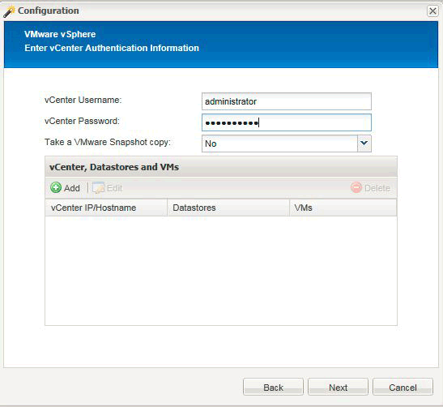

= 하이퍼바이저 플러그인을 사용할 때 다중 레벨 애플리케이션 정지 작업을 위해 Snap Creator를 구성합니다
:icons: font
:imagesdir: ../media/

[role="lead"]
하이퍼바이저("가상화")라고도 함) 플러그인(VMware(VMware vCloud Director 및 VMware vSphere), KVM 및 Citrix XenServer)을 사용하고 다단계 애플리케이션 중지 및 백업 작업을 수행하려는 경우 이러한 유형의 설정에 맞게 Snap Creator를 구성해야 합니다.

이 구성을 사용하면 가상 머신에 있는 애플리케이션을 중지하고 가상 머신을 중지한 다음 스냅샷 복사본을 생성할 수 있습니다.

이 프로세스 중에 하나 이상의 하위 구성 파일로 상위 구성 파일을 지정하여 하이퍼바이저 및 애플리케이션 구성을 생성합니다. 이 상위 구성 파일에는 보존 정책, SVM 세부 정보, 하이퍼바이저 플러그인 정보 등과 같은 일반적인 구성 파일 정보가 포함되어 있습니다. 각 하위 구성 파일에는 특정 응용 프로그램 플러그인을 사용하여 Snap Creator 중지 및 중지 작업을 수행하는 데 필요한 세부 정보가 들어 있습니다.

. 새 프로파일을 만듭니다.
. 새 설정을 작성합니다.
+
.. 구성 페이지에서 구성 파일의 이름을 입력합니다.
+

NOTE: 기본적으로 구성 파일에서 암호가 일반 텍스트로 표시되지 않도록 암호 암호화가 사용됩니다.

.. 플러그인 유형 페이지에서 * 가상화 플러그인 * 을 선택합니다.
.. 가상화 플러그인 페이지에서 구성할 플러그인을 선택합니다.
.. 플러그인 매개 변수 페이지에서 선택한 플러그인 옵션과 관련된 구성 세부 정보를 제공합니다.
+
다음 예에서는 VMware vSphere가 선택한 가상화 플러그인입니다. 표시되는 마법사 화면은 선택에 따라 다릅니다.

+
... 적절한 정보를 입력하고 * 추가 * 를 클릭합니다.
+

... 새 vCenter 페이지에서 vCenter IP 및 호스트 이름을 입력하고 * 추가 * 를 클릭합니다.
... 백업할 데이터 저장소와 가상 머신을 선택합니다.
+
image::../media/scf_config_multilvl_setup_2.gif[SCF 구성 다중 lvl 설정 2]

... 입력한 세부 정보가 올바른지 확인합니다.
... 에이전트 구성 페이지에서 에이전트를 설치한 시스템의 세부 정보인 VMware 에이전트 세부 정보를 제공합니다.
+

NOTE: 포트는 에이전트가 수신 대기하는 포트입니다.

+
에이전트 연결 테스트 * 를 클릭하여 에이전트가 실행되고 있는지 확인합니다.

... 하이퍼바이저 + 앱 백업 페이지에서 하이퍼바이저 및 애플리케이션 정합성 보장 백업이 모두 필요하므로 * 예 * 를 선택합니다.
... 하이퍼바이저 + 앱 구성 페이지에서 하이퍼바이저 및 애플리케이션 구성에 대한 상위 구성 이름을 제공합니다.
... 플러그인 유형 페이지에서 * 응용 프로그램 플러그인 * 을 선택합니다.
... 애플리케이션 플러그인 페이지에서 백업 및 복구에 사용할 애플리케이션을 선택합니다.
... 선택한 애플리케이션에 대한 세부 정보를 제공합니다.
... 에이전트 구성 페이지에서 에이전트를 설치한 애플리케이션 또는 데이터베이스 호스트의 세부 정보인 Snap Creator Agent 애플리케이션 세부 정보를 제공합니다.
+

NOTE: 일반적으로 호스트는 백업되는 가상 시스템이며, 해당 가상 시스템에서 실행되는 애플리케이션이 있습니다.

+
에이전트 연결 테스트 * 를 클릭하여 에이전트가 실행되고 있는지 확인합니다.

... 요약 페이지에서 정보를 확인하고 * 마침 * 을 클릭합니다.
... 하이퍼바이저 + 앱 페이지에는 다음과 같은 옵션이 있습니다.
+
**** 이 구성에 응용 프로그램을 추가하려면 * 추가 * 를 클릭하고 이 예제에서 vii ~ xii 단계를 반복합니다.
**** 이 구성에서 응용 프로그램을 삭제하려면 해당 항목을 선택하고 * Delete * (삭제 *)를 클릭합니다.
**** 기본 구성 마법사를 계속하려면 * 다음 * 을 클릭합니다.
+

NOTE: 여러 개의 응용 프로그램이 나열된 경우 목록에서 응용 프로그램을 위 또는 아래로 이동하여 이 목록의 순서를 재조정할 수 있습니다. 응용 프로그램은 순차적으로 백업되므로 목록의 다른 응용 프로그램 이전에 응용 프로그램을 중지해야 하는 경우 응용 프로그램을 올바른 순서로 배치해야 합니다.

.. 스토리지 연결 설정 페이지에서 다음 정보를 제공합니다.
+
*** Transport * 옵션에서 * HTTPS * 를 선택합니다.
*** 컨트롤러/Vserver 포트 * 옵션의 경우 기본 설정(443)을 그대로 둡니다.
*** Clustered ONTAP * 옵션의 경우 * 예 * 를 선택합니다.image:../media/scf_config_multilvl_setup_3.gif[""]

.. 새 컨트롤러/Vserver 페이지에서 컨트롤러 IP 주소, 사용자 이름 및 암호를 입력합니다.
.. 스냅샷 복사본의 세부 정보를 제공합니다.
+
image::../media/scf_config_multilvl_setup_4.gif[SCF 구성 다중 lvl 설정 4]

.. 스냅샷 세부 정보 계속 페이지에서 * 정합성 보장 그룹 * 옵션을 선택하지 마십시오.
.. 데이터 보호 페이지에서 * 데이터 전송 * 옵션 중 하나를 선택하지 마십시오.
.. 요약 페이지에서 정보를 확인하고 * 마침 * 을 클릭합니다.

* 관련 정보 *

xref:task_creating_profiles.adoc[프로파일 작성]

xref:task_creating_configuration_files_using_sc_gui.adoc[구성 파일을 만드는 중입니다]
