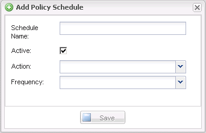

= 정책 일정을 생성하는 중입니다
:icons: font
:imagesdir: ../media/

[role="lead"]
Snap Creator GUI를 사용하여 정책 스케줄을 선택적으로 생성할 수 있습니다.

. Snap Creator GUI 기본 메뉴에서 * Policy * > * Policy Schedules * 를 선택합니다.
. Policy Schedules * 탭에서 * Create * 를 클릭합니다.
. 일정 이름을 입력하고 작업 및 빈도를 선택한 다음 * 저장 * 을 클릭합니다.
+
선택한 빈도에 따라 예약된 작업을 실행하기 위한 적절한 시간 필드를 선택해야 합니다.

+

