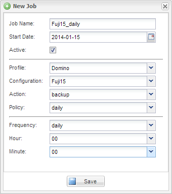

= 백업 예약
:icons: font
:imagesdir: ../media/

[role="lead"]
초기 백업을 수행한 후 반복 백업 작업을 예약할 수 있습니다.

에 설명된 대로 백업에 대한 구성 파일을 만들어야 합니다 xref:task_using_the_gui_to_create_a_configuration_file.adoc[구성 파일 생성].

. 프로파일 및 구성 창에서 구성 파일을 선택하고 Snap Creator 프레임워크 창 상단의 * 관리 * > * 일정 * 을 클릭합니다.
. 작업 창에서 * 생성 * 을 클릭합니다
. 새 작업 대화 상자에서 작업 정보를 지정합니다.
+
|===
| 이 필드의 내용... | 수행할 작업... 

 a| 
작업 이름
 a| 
작업 이름을 입력합니다.

 a| 
시작 날짜
 a| 
일정 컨트롤을 사용하여 일정을 시작할 날짜를 선택합니다.

 a| 
활성
 a| 
일정을 활성화하려면 이 상자를 선택합니다. 일정을 비활성화하려면 이 상자의 선택을 취소합니다.

 a| 
프로파일
 a| 
구성 파일의 프로파일을 선택합니다.

 a| 
구성
 a| 
구성 파일을 선택합니다.

 a| 
조치
 a| 
백업을 선택합니다.

 a| 
정책
 a| 
백업 작업에 대한 정책을 선택합니다. * 참고: * 구성 파일에서 정책을 구성해야 합니다.

 a| 
주파수
 a| 
작업을 실행할 빈도를 선택합니다. 선택에 따라 작업을 실행할 분, 시간 및 날짜를 지정할 수 있는 새 필드가 표시됩니다. cron 작업을 사용하려면 cron을 선택하고 cron 명령을 입력합니다.

|===
+
다음 예에서는 매일 자정에 실행되도록 백업 작업을 예약하는 방법을 보여 줍니다.

+

. 저장 * 을 클릭합니다.
+
예약된 작업이 작업 창의 일정 탭에 나열됩니다. 실행, 편집 또는 삭제할 작업을 선택합니다.

