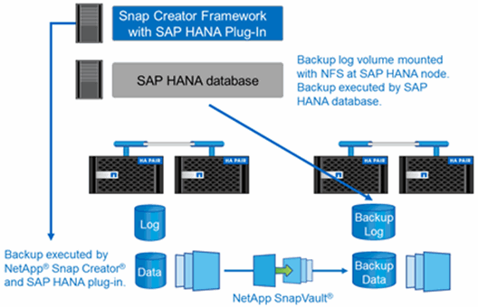

= 백업 솔루션 구성 요소
:allow-uri-read: 
:icons: font
:imagesdir: ../media/

[role="lead"]
SAP HANA용 Snap Creator 백업 솔루션은 스토리지 기반 Snapshot 복사본을 사용한 SAP HANA 데이터 파일 백업, 보조 오프사이트 백업 위치로 데이터 파일 백업 복제, HANA 데이터베이스 로그 백업 기능을 사용한 SAP HANA 로그 파일 백업, 파일 기반 백업을 사용한 데이터베이스 블록 무결성 점검으로 구성됩니다. 그리고 데이터 파일, 로그 파일 백업, SAP HANA 백업 카탈로그의 관리 기능을 모두 제공합니다.

데이터베이스 백업은 Snap Creator를 통해 SAP HANA용 플러그인과 함께 실행됩니다. 이 플러그인을 사용하면 데이터베이스 정합성이 보장되므로 운영 스토리지 시스템에서 생성되는 스냅샷 복사본이 SAP HANA 데이터베이스의 일관된 이미지를 기반으로 생성되도록 할 수 있습니다.

Snap Creator를 사용하면 SnapVault를 통해 일관된 데이터베이스 이미지를 2차 스토리지로 복제할 수 있습니다. 일반적으로 기본 스토리지의 백업과 보조 스토리지의 백업에 대해 서로 다른 보존 정책이 정의됩니다. Snap Creator는 운영 스토리지와 2차 스토리지의 보존을 처리합니다.

로그 백업은 SAP HANA 데이터베이스 툴에 의해 자동으로 실행됩니다. 로그 백업 대상은 데이터베이스의 로그 볼륨이 있는 동일한 스토리지 시스템에 있어서는 안 됩니다. 데이터베이스 백업이 SnapVault로 복제되는 동일한 보조 스토리지에 로그 백업 대상을 구성하는 것이 좋습니다. 이 구성을 사용하면 보조 스토리지의 가용성 요구 사항이 운영 스토리지와 비슷하므로 로그 백업을 항상 보조 스토리지에 기록할 수 있습니다.

고객의 요구 사항에 따라 백업 일정 및 보존 정책을 정의해야 합니다. 다음 표에는 여러 스케줄 및 보존 정책의 구성 예가 나와 있습니다.

|===
|  | Snap Creator에 의해 실행됨 | 운영 스토리지 | 2차 스토리지 

 a| 
데이터베이스 백업
 a| 
일정 1: 4시간마다
 a| 
보존: 6개(\=>6개의 시간별 스냅샷 복사본)
 a| 
보존: 6개(\=>6개의 시간별 스냅샷 복사본)

 a| 
일정 2: 하루에 한 번
 a| 
보존: 3개(\=>3개 일별 스냅샷 복사본)
 a| 
보존: 28(4주)(\=>28일 스냅샷 복사본)
 a| 
로그 백업

 a| 
SAP HANA 데이터베이스 툴 일정: 15분마다
 a| 
해당 없음
 a| 
보존: 28일(4주)
 a| 
블록 무결성 검사

|===
이 예에서는 6시간, 3일 백업이 기본 스토리지에 보관됩니다. 보조 스토리지에서는 데이터베이스 백업이 4주 동안 보관됩니다. 데이터 백업을 복구하려면 로그 백업에 대해 동일한 보존을 설정해야 합니다.
