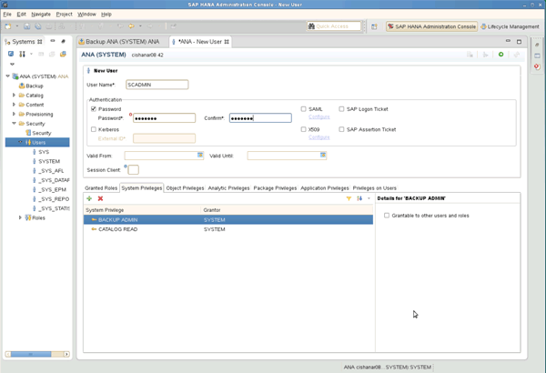

= 백업 사용자 및 hdbuserstore 구성
:icons: font
:imagesdir: ../media/

[role="lead"]
Snap Creator를 통해 백업 작업을 실행하려면 HANA 데이터베이스 내에 전용 데이터베이스 사용자를 구성해야 합니다. 두 번째 단계에서는 이 백업 사용자에 대해 SAP HANA 사용자 저장소 키를 구성해야 합니다. 이 사용자 저장소 키는 Snap Creator SAP HANA 플러그인 구성 내에서 사용됩니다.

백업 사용자에게는 다음 권한이 있어야 합니다.

* 백업 관리자
* 카탈로그 읽기

. 관리 호스트에서 Snap Creator가 설치된 호스트에서 SAP HANA 데이터베이스에 속한 모든 데이터베이스 호스트에 대해 사용자 저장소 키가 구성됩니다. userstore 키는 OS root 사용자 hdbuserstore set keyhost 3 [instance] 15 userPassword로 구성됩니다
. 4개의 데이터베이스 노드 모두에 대한 키를 구성합니다.
+
[listing]
----
mgmtsrv01:/usr/sap/hdbclient32 # ./hdbuserstore set SCADMIN08 cishanar08:34215 SCADMIN Password
mgmtsrv01:/usr/sap/hdbclient32 # ./hdbuserstore set SCADMIN09 cishanar09:34215 SCADMIN Password
mgmtsrv01:/usr/sap/hdbclient32 # ./hdbuserstore set SCADMIN10 cishanar10:34215 SCADMIN password
mgmtsrv01:/usr/sap/hdbclient32 # ./hdbuserstore set SCADMIN11 cishanar11:34215 SCADMIN Password
mgmtsrv01:/usr/sap/hdbclient32 # ./hdbuserstore LIST
DATA FILE       : /root/.hdb/mgmtsrv01/SSFS_HDB.DAT

KEY SCADMIN08
  ENV : cishanar08:34215
  USER: SCADMIN
KEY SCADMIN09
  ENV : cishanar09:34215
  USER: SCADMIN
KEY SCADMIN10
  ENV : cishanar10:34215
  USER: SCADMIN
KEY SCADMIN11
  ENV : cishanar11:34215
  USER: SCADMIN
mgmtsrv01:/usr/sap/hdbclient32
----

