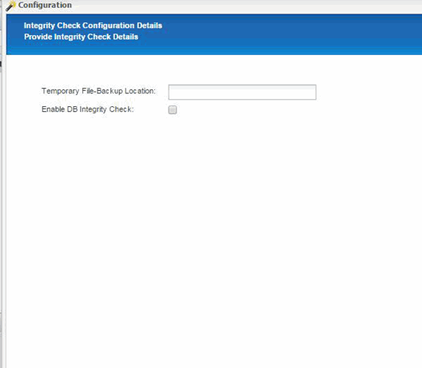
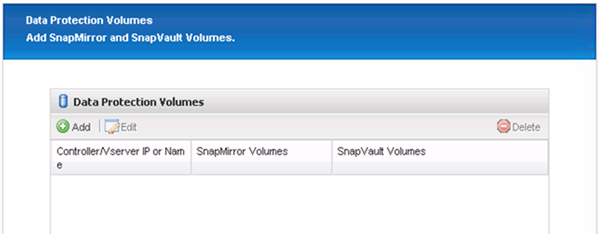
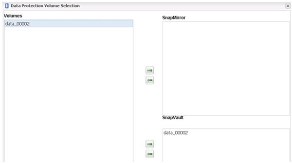

= Snap Creator 프레임워크 및 SAP HANA 데이터베이스 백업 구성
:allow-uri-read: 
:icons: font
:imagesdir: ../media/

[role="lead"]
Snap Creator 프레임워크 및 SAP HANA 데이터베이스 백업을 구성해야 합니다.

. Snap Creator 그래픽 사용자 인터페이스(GUI)에 연결: https://host:8443/ui/[].
. 설치 중에 구성된 사용자 이름과 암호를 사용하여 로그인합니다. 로그인 * 을 클릭합니다.
+
image::../media/snap_creator_gui.gif[에서는 Snap Creator GUI 로그인을 보여 줍니다]

. 프로파일 이름을 입력하고 * 확인 * 을 클릭합니다.
+
image::../media/sap_hana_user_profile.gif[SAP HANA 사용자 프로필]

+
예를 들어, ""ANA""는 데이터베이스의 SID입니다.

. 구성 이름을 입력하고 * 다음 * 을 클릭합니다.
+
image::../media/sap_hana_gui_for_configuration_name.gif[필드에 입력한 구성 이름을 표시합니다]

. 플러그인 유형으로 * Application plug-in * 을 선택하고 * Next * 를 클릭합니다.
+
image::../media/sap_hana_config_plugin_type.gif[선택 애플리케이션 플러그인을 표시합니다]

. 애플리케이션 플러그인으로 * SAP HANA * 를 선택하고 * 다음 * 을 클릭합니다.
+
image::../media/sap_hana_select_application_plug_in.gif[SAP HANA 애플리케이션 플러그인 선택]

. 다음 구성 세부 정보를 입력합니다.
+
.. 드롭다운 메뉴에서 * 예 * 를 선택하여 멀티테넌트 데이터베이스에 구성을 사용합니다. 단일 컨테이너 데이터베이스의 경우 * No * 를 선택합니다.
.. 다중 테넌트 데이터베이스 컨테이너가 * 아니요 * 로 설정된 경우 데이터베이스 SID를 제공해야 합니다.
.. 다중 테넌트 데이터베이스 컨테이너가 * 예 * 로 설정된 경우 각 SAP HANA 노드에 대해 hdBuserstore 키를 추가해야 합니다.
.. 테넌트 데이터베이스의 이름을 추가합니다.
.. hdbsql 문을 실행해야 하는 HANA 노드를 추가합니다.
.. HANA 노드 인스턴스 번호를 입력합니다.
.. hdbsql 실행 파일의 경로를 제공합니다.
.. OSDB 사용자를 추가합니다.
.. 드롭다운 목록에서 * 예 * 를 선택하여 로그 정리를 활성화합니다.
+
참고:

+
*** 파라미터 'HANA_멀티테넌트_데이터베이스'의 값이 'N'으로 설정된 경우에만 파라미터 'HANA_SID'를 사용할 수 있습니다
*** "단일 테넌트" 리소스 유형이 있는 다중 테넌트 데이터베이스 컨테이너(MDC)의 경우 SAP HANA 스냅샷 복제본은 UserStore 키 기반 인증과 함께 작동합니다. HANA_multi_database' 파라미터를 Y로 설정한 경우 해당 값으로 Hana_USERSTORE_keys 파라미터를 설정해야 한다.
*** 멀티 테넌트 이외의 데이터베이스 컨테이너와 마찬가지로 파일 기반 백업 및 무결성 검사 기능이 지원됩니다

.. 다음 * 을 클릭합니다.

+
image::../media/file_based_backup_configuration.gif[파일 기반 백업 구성]

. 파일 기반 백업 작업 활성화:
+
.. 파일 - 백업 위치를 설정합니다.
.. 파일 백업 접두사를 지정합니다.
.. 파일 백업 사용 * 확인란을 선택합니다.
.. 다음 * 을 클릭합니다.
+
image::../media/enable_file_based_backup.gif[파일 기반 백업을 설정합니다]

. 데이터베이스 무결성 검사 작업 활성화:
+
.. 임시 파일 백업 위치를 설정합니다.
.. DB 무결성 검사 사용 * 확인란을 선택합니다.
.. 다음 * 을 클릭합니다.

+

. 에이전트 구성 매개 변수의 세부 정보를 입력하고 * 다음 * 을 클릭합니다.
+
image::../media/sap_hana_agent_configuration_parameter.gif[이 이미지는 주변 텍스트로 설명됩니다.]

. 저장소 연결 설정을 입력하고 * 다음 * 을 클릭합니다.
+
image::../media/sap_hana_storage_connect_gui.gif[이 이미지는 주변 텍스트로 설명됩니다.]

. 스토리지 로그인 자격 증명을 입력하고 * Next * 를 클릭합니다.
+
image::../media/sap_hana_storage_login_credentials_gui.gif[이 이미지는 주변 텍스트로 설명됩니다.]

. 이 스토리지 컨트롤러에 저장된 데이터 볼륨을 선택하고 * Save * 를 클릭합니다.
+
image::../media/sap_hana_select_data_volumes.gif[이 이미지는 주변 텍스트로 설명됩니다.]

. 추가 * 를 클릭하여 다른 스토리지 컨트롤러를 추가합니다.
+
image::../media/sap_hana_add_controller.gif[이 이미지는 주변 텍스트로 설명됩니다.]

. 스토리지 로그인 자격 증명을 입력하고 * Next * 를 클릭합니다.
+
image::../media/sap_hana_storage_login_credentials2.gif[이 이미지는 주변 텍스트로 설명됩니다.]

. 생성한 두 번째 스토리지 컨트롤러에 저장된 데이터 볼륨을 선택하고 * Save * 를 클릭합니다.
+
image::../media/sap_hana_controller_volumes_selection.gif[이 이미지는 주변 텍스트로 설명됩니다.]

. 컨트롤러/Vserver 자격 증명 창에는 추가한 스토리지 컨트롤러 및 볼륨이 표시됩니다. 다음 * 을 클릭합니다.
+
image::../media/sap_hana_view_storage_credentials.gif[이 이미지는 주변 텍스트로 설명됩니다.]

. 스냅샷 정책 및 보존 구성을 입력합니다.
+
예를 들어, 매일 3개, 8개의 시간별 스냅샷 복사본을 유지하는 것은 고객의 요구사항에 따라 다르게 구성할 수 있습니다.

+

NOTE: 이름 지정 규칙으로 * Timestamp * 를 선택합니다. SAP HANA 백업 카탈로그 항목에 스냅샷 복사본의 타임스탬프도 사용되므로 명명 규칙 * Recent * 는 SAP HANA 플러그인에서 지원되지 않습니다.

+
image::../media/sap_hana_snapshot_details_gui.gif[이 이미지는 주변 텍스트로 설명됩니다.]

. 변경할 필요가 없습니다. 다음 * 을 클릭합니다.
+
image::../media/sap_hana_snapshot_details_continued_gui.gif[이 이미지는 주변 텍스트로 설명됩니다.]

. SnapVault * 를 선택하고 SnapVault 보존 정책 및 SnapVault 대기 시간을 구성합니다.
+
image::../media/sap_hana_data_protection_gui.gif[이 이미지는 주변 텍스트로 설명됩니다.]

. 추가 * 를 클릭합니다.
+

. 목록에서 소스 스토리지 컨트롤러를 선택하고 * 다음 * 을 클릭합니다.
+
image::../media/sap_hana_dp_volumes_gui_select_storage_controller.gif[이 이미지는 주변 텍스트로 설명됩니다.]

. 소스 스토리지 컨트롤러에 저장된 볼륨을 모두 선택하고 * Save * 를 클릭합니다.
+
image::../media/sap_hana_volume_selection_gui.gif[이 이미지는 주변 텍스트로 설명됩니다.]

. 추가 * 를 클릭하고 목록에서 두 번째 소스 스토리지 컨트롤러를 선택한 후 * 다음 * 을 클릭합니다.
+
image::../media/sap_hana_configuration_data_protection_volumes_select_controller.gif[이 이미지는 주변 텍스트로 설명됩니다.]

. 두 번째 소스 스토리지 컨트롤러에 저장된 볼륨을 모두 선택하고 * Save * 를 클릭합니다.
+

. Data Protection Volumes(데이터 보호 볼륨) 창에는 사용자가 생성한 구성에서 보호해야 하는 모든 볼륨이 표시됩니다. 다음 * 을 클릭합니다.
+
image::../media/sap_hana_data_protection_volumes_gui.gif[이 이미지는 주변 텍스트로 설명됩니다.]

. 대상 스토리지 컨트롤러의 자격 증명을 입력하고 * Next * 를 클릭합니다. 이 예에서는 스토리지 시스템을 액세스하는 데 ""root"" 사용자 자격 증명이 사용됩니다. 일반적으로 전용 백업 사용자는 스토리지 시스템에 구성되어 있으며 Snap Creator와 함께 사용됩니다.
+
image::../media/sap_hana_data_protection_relationships_gui.gif[이 이미지는 주변 텍스트로 설명됩니다.]

. 다음 * 을 클릭합니다.
+
image::../media/sap_hana_dfm_oncommand_settings_gui.gif[DFM/OnCommand 설정 GUI 이 이미지는 주변 텍스트로 설명됩니다.]

. 마침 * 을 클릭하여 구성을 완료합니다.
+
image::../media/sap_hana_data_protection_configuration_summary.gif[이 이미지는 주변 텍스트로 설명됩니다.]

. SnapVault 설정 * 탭을 클릭합니다.
. SnapVault 복원 대기 * 옵션의 드롭다운 목록에서 * 예 * 를 선택하고 * 저장 * 을 클릭합니다.
+
image::../media/sap_hana_snapvault_settings_gui.gif[이 이미지는 주변 텍스트로 설명됩니다.]

+
복제 트래픽에 전용 네트워크를 사용하는 것이 좋습니다. 그렇게 하기로 결정한 경우 이 인터페이스를 Snap Creator 구성 파일에 2차 인터페이스로 포함해야 합니다.

+
스토리지 컨트롤러의 호스트 이름에 바인딩되지 않은 네트워크 인터페이스를 사용하여 Snap Creator가 소스 또는 타겟 스토리지 시스템에 액세스할 수 있도록 전용 관리 인터페이스를 구성할 수도 있습니다.

+
[listing]
----
mgmtsrv01:/opt/NetApp/Snap_Creator_Framework_411/scServer4.1.1c/engine/configs/HANA_profile_ANA
# vi ANA_database_backup.conf

#####################################################################
########################
#     Connection Options                                            #
#####################################################################
########################
PORT=443
SECONDARY_INTERFACES=hana1a:hana1a-rep/hana2b;hana1b:hana1b-rep/hana2b
MANAGEMENT_INTERFACES=hana2b:hana2b-mgmt
----

