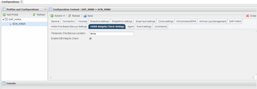

= 데이터베이스 무결성 검사를 위한 구성 수정
:allow-uri-read: 
:icons: font
:imagesdir: ../media/

[role="lead"]
데이터베이스 무결성 검사에 대해 구성된 매개 변수를 수정할 수 있습니다. 이후의 예약 또는 온디맨드 무결성 검사 작업에는 업데이트된 정보가 반영됩니다.

. SAP HANA 프로필을 클릭합니다.
. 수정할 구성을 선택하고 * HANA 무결성 검사 설정 * 을 클릭합니다.
+

. 정보를 편집하고 * 저장 * 을 클릭합니다.

