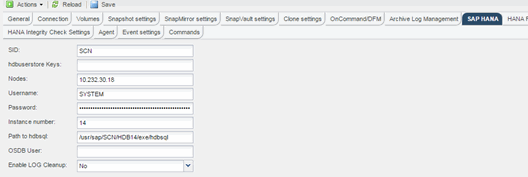

= 로그 백업의 정리 작업 수정
:icons: font
:imagesdir: ../media/

[role="lead"]
로그 정리 작업을 비활성화하려면 로그 백업의 하우스키핑에 대해 구성된 매개 변수를 수정할 수 있습니다.

. 수정할 SAP HANA 프로필을 선택합니다.
. 수정할 구성을 선택하고 * SAP HANA 설정 * 을 클릭합니다.
. Enable log cleanup 매개 변수를 편집하고 * Save * 를 클릭합니다.
+

