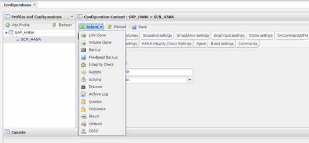

= Snap Creator GUI에서 파일 기반 백업 수행
:allow-uri-read: 
:icons: font
:imagesdir: ../media/

[role="lead"]
Snap Creator 그래픽 사용자 인터페이스(GUI)에서 파일 기반 백업을 수행할 수 있습니다.

HANA 파일 기반 백업 설정 탭에서 파일 기반 백업 매개 변수를 사용하도록 설정해야 합니다.

. HANA_DATABASE_BACKUP 구성을 선택합니다.
. Actions * > * File-Based Backup * 을 선택합니다.
+

. 정책 옵션을 * 없음 * 으로 설정하고 * 확인 * 을 클릭합니다.
+
image::../media/performing_file_based_backup_with_gui_2.gif[GUI를 사용하여 파일 기반 백업 수행]

