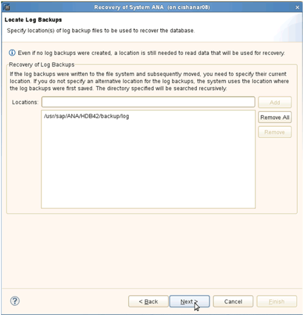

= 보조 스토리지에서 데이터베이스 복원 및 복구
:icons: font
:imagesdir: ../media/

[role="lead"]
보조 스토리지에서 데이터베이스를 복원 및 복구할 수 있습니다.

. SAP HANA Studio 내에서 SAP HANA 시스템에 대해 * Recover * 를 선택합니다.
+
image::../media/sap_hana_recovery_secondary_storage_gui.gif[이 이미지는 주변 텍스트로 설명됩니다.]

+
SAP HANA 시스템이 종료됩니다.

. 복구 유형을 선택하고 * 다음 * 을 클릭합니다.
+
image::../media/sap_hana_secondary_specify_recovery_type.gif[이 이미지는 주변 텍스트로 설명됩니다.]

. 로그 백업 위치를 제공하고 * 다음 * 을 클릭합니다.
+

+
사용 가능한 백업 목록은 백업 카탈로그 콘텐츠를 기반으로 표시됩니다.

. 필요한 백업을 선택하고 외부 백업 ID를 기록합니다.
+
image::../media/sap_hana_recover_secondary_select_backup.gif[이 이미지는 주변 텍스트로 설명됩니다.]

. Snap Creator GUI로 이동합니다.
. SAP HANA 시스템을 선택한 다음 * Actions * > * Restore * 를 클릭합니다.
+
image::../media/sap_hana_secondary_select_backup_restore.gif[이 이미지는 주변 텍스트로 설명됩니다.]

+
시작 화면이 나타납니다.

+
image::../media/sap_hana_secondary_welcome_screen.gif[이 이미지는 주변 텍스트로 설명됩니다.]

. 다음 * 을 클릭합니다.
. Secondary * 를 선택하고 * Next * 를 클릭합니다.
+
image::../media/sap_hana_secondary_restore.gif[이 이미지는 주변 텍스트로 설명됩니다.]

. 필요한 정보를 입력합니다. 스냅샷 이름은 SAP HANA Studio에서 선택한 백업 ID와 상호 연관됩니다.
+
image::../media/sap_hana_select_backup_restore04_secondary_scf_gui.gif[이 이미지는 주변 텍스트로 설명됩니다.]

. 마침 * 을 선택합니다.
+
image::../media/sap_hana_secondary_restore_summary.gif[이 이미지는 주변 텍스트로 설명됩니다.]

. 복원할 항목을 더 추가하려면 * 예 * 를 클릭합니다.
+
image::../media/sap_hana_secondary_snapshot_settings_warning.gif[이 이미지는 주변 텍스트로 설명됩니다.]

. 복원해야 하는 모든 볼륨에 필요한 정보를 제공합니다. 설정 DATA_00001, DATA_00002 및 DATA_00003을 복원 프로세스에 대해 선택해야 합니다.
+
image::../media/sap_hana_secondary_snapvault_restore.gif[이 이미지는 주변 텍스트로 설명됩니다.]

. 모든 볼륨을 선택한 후 * OK * 를 선택하여 복원 프로세스를 시작합니다.
+
복원 프로세스가 완료될 때까지 기다립니다.

. 각 데이터베이스 노드에서 모든 데이터 볼륨을 다시 마운트하여 "'이(가) NFS 처리"를 정리하십시오.
+
이 예에서는 세 개의 볼륨을 각 데이터베이스 노드에 다시 마운트해야 합니다.

+
[listing]
----
mount -o remount /hana/data/ANA/mnt00001
mount -o remount /hana/data/ANA/mnt00002
mount -o remount /hana/data/ANA/mnt00003
----
. SAP HANA Studio로 이동하고 * Refresh * 를 클릭하여 백업 목록을 업데이트합니다.
+
image::../media/sap_hana_secondary_select_backup_to_recover.gif[이 이미지는 주변 텍스트로 설명됩니다.]

. Snap Creator를 통해 복구된 백업은 백업 목록에 녹색 아이콘과 함께 표시됩니다. 백업을 선택하고 * 다음 * 을 클릭합니다.
. 필요에 따라 다른 설정을 선택하고 * 다음 * 을 클릭합니다.
+
image::../media/sap_hana_secondary_other_settings.gif[이 이미지는 주변 텍스트로 설명됩니다.]

. 마침 * 을 클릭합니다.
+
image::../media/sap_hana_secondary_review_recovery_settings.gif[이 이미지는 주변 텍스트로 설명됩니다.]

+
복구 프로세스가 시작됩니다.

+
image::../media/sap_hana_secondary_recovery_progress_information.gif[이 이미지는 주변 텍스트로 설명됩니다.]

. 복구 프로세스가 완료된 후 필요한 경우 SnapVault 관계를 다시 시작합니다.
+
image::../media/sap_hana_secondary_recovery_execution_summary.gif[이 이미지는 주변 텍스트로 설명됩니다.]

