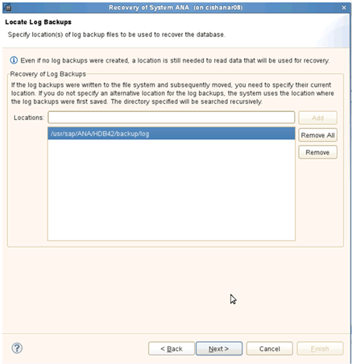
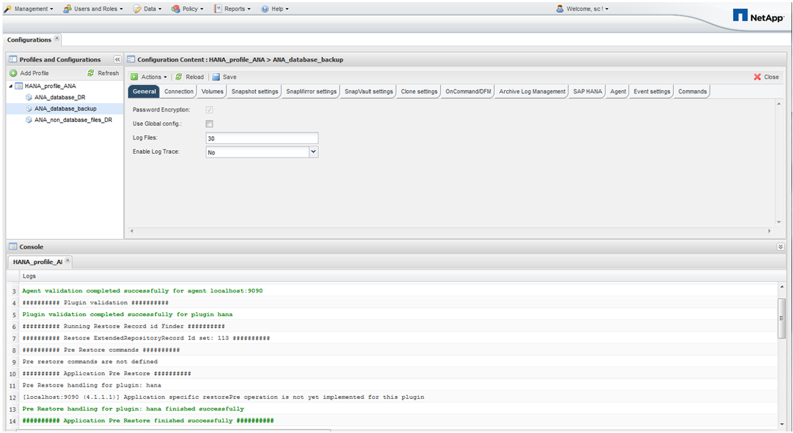
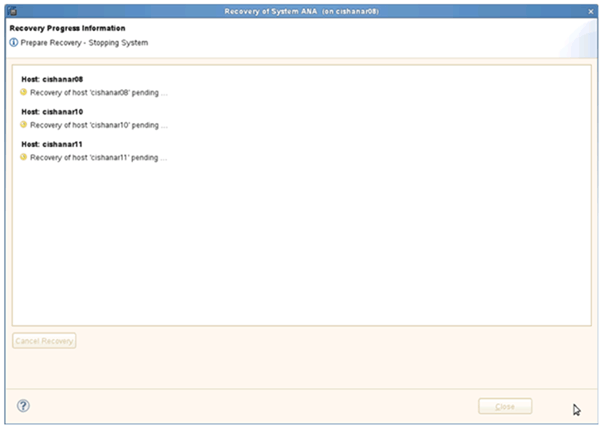

= 운영 스토리지에서 데이터베이스 복원 및 복구
:allow-uri-read: 
:icons: font
:imagesdir: ../media/

[role="lead"]
기본 스토리지에서 데이터베이스를 복원 및 복구할 수 있습니다.

NOTE: Snap Creator에서 파일 기반 백업 복사본을 복원할 수 없습니다.

. SAP HANA Studio 내에서 SAP HANA 시스템에 대해 * Recover * 를 선택합니다.
+
image::../media/sap_hana_recover_primary_gui.gif[이 이미지는 주변 텍스트로 설명됩니다.]

+
SAP HANA 시스템이 종료됩니다.

. 복구 유형을 선택하고 * 다음 * 을 클릭합니다.
+
image::../media/sap_hana_specify_recovery_type_gui.gif[이 이미지는 주변 텍스트로 설명됩니다.]

. 로그 백업 위치를 입력하고 * Next * 를 클릭합니다.
+

+
표시되는 사용 가능한 백업 목록은 백업 카탈로그 콘텐츠를 기반으로 합니다.

. 필요한 백업을 선택하고 외부 백업 ID를 기록합니다.
+
image::../media/sap_hana_recovery_primary_select_backup.gif[이 이미지는 주변 텍스트로 설명됩니다.]

. SnapVault 관계를 비활성화합니다.
+

NOTE: 이 단계는 clustered Data ONTAP에만 필요합니다.

+
SnapVault의 기본 스냅샷 복사본으로 현재 사용 중인 스냅샷 복사본보다 이전 버전의 스냅샷 복사본을 복원해야 하는 경우 먼저 clustered Data ONTAP에서 SnapVault 관계를 비활성화해야 합니다. 이렇게 하려면 백업 클러스터 콘솔에서 다음 명령을 실행합니다.

+
[listing]
----
hana::> snapmirror quiesce -destination-path hana2b:backup_hana_data
Operation succeeded: snapmirror quiesce for destination hana2b:backup_hana_data.

hana::> snapmirror delete -destination-path hana2b:backup_hana_data
Operation succeeded: snapmirror delete the relationship with destination hana2b:backup_hana_data.

hana::> snapmirror release -destination-path hana2b:backup_hana_data
[Job 6551] Job succeeded: SnapMirror Release Succeeded
----
. Snap Creator GUI에서 SAP HANA 시스템을 선택한 다음 * Actions * > * Restore * 를 선택합니다.
+
image::../media/sap_hana_select_restore_backup.gif[이 이미지는 주변 텍스트로 설명됩니다.]

+
Snap Creator Framework 복원 마법사 시작 화면이 나타납니다.

. 다음 * 을 클릭합니다.
+
image::../media/sap_hana_primary_restore_welcome_screen.gif[이 이미지는 주변 텍스트로 설명됩니다.]

. Primary * 를 선택하고 * Next * 를 클릭합니다.
+
image::../media/sap_hana_primary_restore_primary_select.gif[이 이미지는 주변 텍스트로 설명됩니다.]

. 운영 스토리지에서 복구를 선택합니다.
. 스토리지 컨트롤러, 볼륨 이름 및 스냅샷 이름을 선택합니다.
+
스냅샷 이름은 SAP HANA Studio에서 선택한 백업 ID와 상호 연관됩니다.

+
image::../media/sap_hana_select_backup_restore_scf_gui.gif[이 이미지는 주변 텍스트로 설명됩니다.]

. 마침 * 을 클릭합니다.
+
image::../media/sap_hana_primary_restore_summary.gif[이 이미지는 주변 텍스트로 설명됩니다.]

. 복원 항목을 더 추가하려면 * 예 * 를 클릭합니다.
+
image::../media/sap_hana_add_more_restore_items.gif[이 이미지는 주변 텍스트로 설명됩니다.]

. 스토리지 컨트롤러, 추가 볼륨 이름 및 스냅샷 이름을 선택합니다.
+
스냅샷 이름은 SAP HANA Studio에서 선택한 백업 ID와 상호 연관됩니다.

+
image::../media/sap_hana_primary_select_restore_details.gif[이 이미지는 주변 텍스트로 설명됩니다.]

. 필요한 모든 볼륨이 추가될 때까지 10단계부터 13단계까지 반복합니다. 이 예에서는 복원 프로세스에 대해 data_00001, data_00002 및 data_00003을 선택해야 합니다.
. 모든 볼륨을 선택한 후 * OK * 를 클릭하여 복원 프로세스를 시작합니다.
+
image::../media/sap_hana_select_volume_restore.gif[이 이미지는 주변 텍스트로 설명됩니다.]

+
복원 프로세스가 시작됩니다.

+

+
복원 프로세스가 완료될 때까지 기다립니다.

. 각 데이터베이스 노드에서 모든 데이터 볼륨을 다시 마운트하여 오래된 NFS 핸들을 정리합니다.
+
이 예에서는 세 개의 볼륨을 각 데이터베이스 노드에 다시 마운트해야 합니다.

+
[listing]
----
mount -o remount /hana/data/ANA/mnt00001
mount -o remount /hana/data/ANA/mnt00002
mount -o remount /hana/data/ANA/mnt00003
----
. SAP HANA Studio로 이동하여 * Refresh * 를 클릭하여 사용 가능한 백업 목록을 업데이트합니다.
+
image::../media/sap_hana_primary_select_backup.gif[이 이미지는 주변 텍스트로 설명됩니다.]

+
Snap Creator를 통해 복구된 백업은 백업 목록에 녹색 아이콘과 함께 표시됩니다.

. 백업을 선택하고 * 다음 * 을 클릭합니다.
+
image::../media/sap_hana_select_backup_to_recover_database.gif[이 이미지는 주변 텍스트로 설명됩니다.]

. 필요에 따라 다른 설정을 선택하고 * 다음 * 을 클릭합니다.
+
image::../media/sap_hana_select_backup_other_settings.gif[이 이미지는 주변 텍스트로 설명됩니다.]

. 마침 * 을 클릭합니다.
+
image::../media/sap_hana_primary_review_recory_settings.gif[이 이미지는 주변 텍스트로 설명됩니다.]

+
복구 프로세스가 시작됩니다.

+

. 복구가 완료된 후 필요한 경우 SnapVault 관계를 다시 시작합니다.
+
image::../media/sap_hana_primary_recovery_execution_summary.gif[이 이미지는 주변 텍스트로 설명됩니다.]

